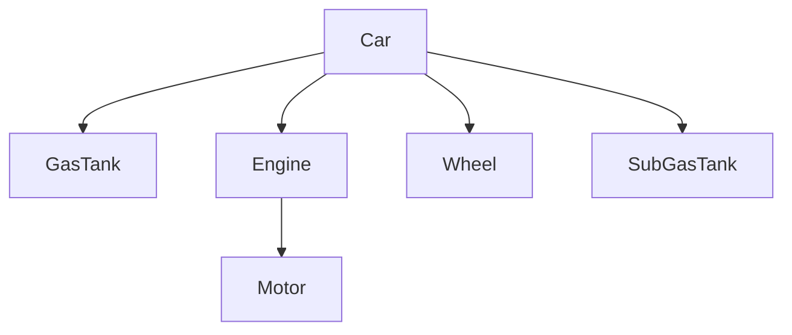

[](https://maven-badges.herokuapp.com/maven-central/com.github.wnameless.spring.boot.up/spring-boot-up-data-mongodb)

spring-boot-up-data-mongodb
=============
MongoDB enhancement brought by SpringBootUp.

## Purpose - reduces the boilerplate code followed by Spring @DBRef
Init:
```java
var car  = new Car();
var gasTank =  new GasTank();
var engine  = new Engine();
var motor = new Motor();
var frontRightWheel = new Wheel();
var frontLeftWheel = new Wheel();
var rareRightWheel = new Wheel();
var rareLeftWheel = new Wheel();
var wheels = Arrays.asList(frontRightWheel, frontLeftWheel, rareRightWheel, rareLeftWheel);
```

Entity relationship model:


___Before___ intoducing this lib, we have to save all documents before constructing the `@DBRef`.
```java
carRepository.save(car);

gasTankRepository.save(gasTank);

engine.setCar(car);
engineRepository.save(engine);

motor.setEngine(engine);
motor.setCar(car);
motorRepository.save(motor);

engine.setMotor(motor);
engineRepository.save(engine);

frontRightWheel.setCar(car);
frontLeftWheel.setCar(car);
rareRightWheel.setCar(car);
rareLeftWheel.setCar(car);
wheelRepository.save(wheels);

car.setGasTank(gasTank);
car.setEngine(engine);
car.setWheels(wheels);
carRepository.save(car);
```

___After___ intoducing this lib, we only need to focus on the relationships between documents.
```java
car.setGasTank(gasTank);
car.setEngine(engine);
engine.setMotor(motor);
car.setWheels(wheels);

carRepository.save(car);
```

# Maven Repo
```xml
<dependency>
	<groupId>com.github.wnameless.spring.boot.up</groupId>
	<artifactId>spring-boot-up-data-mongodb</artifactId>
	<version>${newestVersion}</version>
	<!-- Newest version shows in the maven-central badge above -->
</dependency>
```
```diff
! Maven dependency spring-boot-starter-data-mongodb is required.
```
The version follows the pattern of {MajorVersion.MinorVersion.IncrementalVersion}.<br>
However, the MajorVersion is always matched the Spring Boot major version.<br>
Only MinorVersion and IncrementalVersion are used to represent the changes of this library.

# Quick Start
```java
@EnableSpringBootUpMongo(allowAnnotationDrivenEvent = true) // Default value is false
@EnableSpringBootUp
@Configuration
public class MyConfiguration {}
```

```java
@Repository
public interface CarRepository extends MongoRepository<Car, String>, MongoProjectionRepository<Car> {}
// With projection feature

// public interface CarRepository extends MongoRepository<Car, String> {}
// Without projection feature
```

# Feature List<a id='top'></a>
| Name | Description | Since |
| --- | --- | --- |
| [Cascade(@CascadeRef)](#3.0.0-1) | Cascade feature for Spring Data MongoDB entities | v3.0.0 |
| [@ParentRef](#3.0.0-2) | Automatically populates the cascade publisher object into @ParentRef annotated field of the cascade receiver | v3.0.0 |
| [Annotation Driven Event](#3.0.0-3) | Annotation Driven Event feature for Mongo Event | v3.0.0 |
| [Projection](#3.0.0-4) | Projection feature supports both QueryDSL Predicate and Spring Data Query | v3.0.0 |
| [Custom Conversions](#3.0.0-5) | MongoCustomConversions for Java 8 Date/Time | v3.0.0 |

### [:top:](#top) Cascade<a id='3.0.0-1'></a>
Entity classes:
```java
@EqualsAndHashCode(of = "id")
@Data
@Document
public class Car {
  @Id
  String id;

  @CascadeRef({CascadeType.CREATE, CascadeType.DELETE})
  @DBRef
  Engine engine;

  @CascadeRef({CascadeType.CREATE})
  @DBRef
  GasTank gasTank;

  @CascadeRef // Equivalent to @CascadeRef(CascadeType.ALL)
  @DBRef
  List<Wheel> wheels = new ArrayList<>();

  @CascadeRef({CascadeType.UPDATE, CascadeType.DELETE})
  @DBRef
  GasTank subGasTank;
}
```
```java
@EqualsAndHashCode(of = "id")
@Data
@Document
public class GasTank {
  @Id
  String id;

  @ParentRef
  @DBRef
  Car car;

  double capacity = 100;
}
```
```java
@EqualsAndHashCode(of = "id")
@Data
@Document
public class Engine {
  @Id
  String id;

  @ParentRef
  @DBRef
  Car car;

  double horsePower = 500;

  @CascadeRef
  @DBRef
  Motor motor;
}
```
```java
@EqualsAndHashCode(of = "id")
@Data
@Document
public class Motor {
  @Id
  String id;

  @ParentRef
  @DBRef
  Engine engine;

  @ParentRef("car")
  @DBRef
  Car car;

  double rpm = 60000;
}
```
```java
@EqualsAndHashCode(of = "id")
@Data
@Document
public class Wheel {
  @Id
  String id;

  @ParentRef
  @DBRef
  Car car;

  String tireBrand = "MAXXIS";
}

```

JUnit `BeaforeEach`
```java
mongoTemplate.getDb().drop();

car.setGasTank(gasTank);
car.setEngine(engine);
engine.setMotor(motor);
car.setWheels(Arrays.asList(frontRightWheel, frontLeftWheel, rareRightWheel, rareLeftWheel));
carRepository.save(car);
```

Test `CascadeType.CREATE`
```java
assertEquals(1, carRepository.count());
assertEquals(1, gasTankRepository.count());
assertEquals(1, engineRepository.count());
assertEquals(1, motorRepository.count());
assertEquals(4, wheelRepository.count());
```

Test `CascadeType.UPDATE`
```java
car = new Car();
var subGasTank = new GasTank();
car.setSubGasTank(subGasTank);
// Because this car object hasn't been saved, so the CascadeType.UPDATE about the subGasTank object won't be performed
assertThrows(RuntimeException.class, () -> {
  carRepository.save(car);
});

car = new Car();
carRepository.save(car);
var subGasTank = new GasTank();
car.setSubGasTank(subGasTank);
carRepository.save(car);
// Because this car object has been saved, so the CascadeType.UPDATE is performed
assertSame(subGasTank, car.getSubGasTank());
```

Test `CascadeType.DELETE`
```java
carRepository.deleteAll();
assertEquals(0, carRepository.count());
assertEquals(1, engineRepository.count());
assertEquals(1, motorRepository.count());
assertEquals(1, gasTankRepository.count());
assertEquals(4, wheelRepository.count());
```
```diff
- Cascade is NOT working on bulk operations(ex: CrudRepository#deleteAll).
```
```java
carRepository.deleteAll(carRepository.findAll()); 
assertEquals(0, carRepository.count());
assertEquals(0, engineRepository.count());
assertEquals(0, motorRepository.count());
assertEquals(1, gasTankRepository.count());
// gasTank won't be deleted because it's only annotated with @CascadeRef(CascadeType.CREATE)
assertEquals(0, wheelRepository.count());
```
```diff
+ Using CrudRepository#deleteAll(Iterable) instead of CrudRepository#deleteAll can perform cascade normally in most circumstances.
```

### [:top:](#top) @ParentRef<a id='3.0.0-2'></a>
For example:<br>
Car object publishes cascade events to GasTank object,
so Car object can be treated as a _parent_ of GasTank object,
therefore the field of a GasTank, which is annotated by `@ParentRef`,
will be set by Car object automatically.
```java
@EqualsAndHashCode(of = "id")
@Data
@Document
public class GasTank {
  @Id
  String id;

  @ParentRef
  @DBRef
  Car car;

  double capacity = 100;
}
```

Test `@ParentRef`
```java
assertSame(car, gasTank.getCar());
assertSame(car, engine.getCar());
assertSame(car, motor.getCar());
assertSame(engine, motor.getEngine());
assertSame(car, frontRightWheel.getCar());
assertSame(car, frontLeftWheel.getCar());
assertSame(car, rareRightWheel.getCar());
assertSame(car, rareLeftWheel.getCar());
```

### [:top:](#top) Annotation Driven Event<a id='3.0.0-3'></a>
There are 6 types of annotation driven events:

* BeforeConvertToMongo
* BeforeSaveToMongo
* AfterSaveToMongo
* AfterConvertFromMongo
* BeforeDeleteFromMongo
* AfterDeleteFromMongo


All annotated methods will be triggered in corresponding MongoDB events lifecycle.
Annotated methods can only accept empty or single `SourceAndDocument` as argument.
`SourceAndDocument` stores both the event source object and event BSON Document at that point.
```java
@Document
public class Car {
  @Id
  String id;

  @BeforeConvertToMongo
  void beforeConvert() {
    System.out.println("beforeConvertToMongo");
  }

  @BeforeConvertToMongo
  void beforeConvertArg(SourceAndDocument sad) {
    var car = sad.getSource(Car.class);
  }

  @BeforeSaveToMongo
  void beforeSave() {
    System.out.println("beforeSaveToMongo");
  }

  @BeforeSaveToMongo
  void beforeSaveArg(SourceAndDocument sad) {
    var car = sad.getSource(Car.class);
  }

  @AfterSaveToMongo
  void afterSave() {
    System.out.println("afterSaveToMongo");
  }

  @AfterSaveToMongo
  void afterSaveArg(SourceAndDocument sad) {
    var car = sad.getSource(Car.class);
  }

  @AfterConvertFromMongo
  void afterConvert() {
    System.out.println("afterConvertFromMongo");
  }

  @AfterConvertFromMongo
  void afterConvertArg(SourceAndDocument sad) {
    var car = sad.getSource(Car.class);
  }

  @BeforeDeleteFromMongo
  void beforeDeleteFromMongo() {
    System.out.println("beforeDeleteFromMongo");
  }

  @BeforeDeleteFromMongo
  void beforeDeleteFromMongoArg(SourceAndDocument sad) {
    var car = sad.getSource(Car.class);
  }

  @AfterDeleteFromMongo
  void afterDeleteFromMongo() {
    System.out.println("afterDeleteFromMongo");
  }

  @AfterDeleteFromMongo
  void afterDeleteFromMongoArg(SourceAndDocument sad) {
    var car = sad.getSource(Car.class);
  }
}
```
```diff
- Annotation Driven Event won't be triggered under Mongo bulk operations.
```

### [:top:](#top) Projection<a id='3.0.0-4'></a>
Entity classes:
```java
@EqualsAndHashCode(of = "id")
@Data
@Document
public class ComplexModel {
  @Id
  String id;

  String str;

  Integer i;

  Double d;

  Boolean b;

  NestedModel nested;
}
```
```java
@Data
public class NestedModel {
  Float f;

  Short s;
}
```
```java
@Data
public class ProjectModel {
  String str;
}
```

Init:
```java
var model = new ComplexModel();
model.setStr("str");
model.setI(123);
model.setD(45.6);
model.setB(true);
var nested = new NestedModel();
nested.setF(7.8f);
nested.setS((short) 9);
model.setNested(nested);
complexModelRepository.save(model);
```

Projection can be performed by 3 ways:
```java
// By dot path - allows to use dot operator(.) to represent nested projection object
complexModelRepository.findAllProjectedBy("str");

// JUnit
// assertEquals("str", model.getStr());
// assertNull(model.getI());
// assertNull(model.getD());
// assertNull(model.getB());
// assertNull(model.getNested());

complexModelRepository.findProjectedBy("nested.f");

// JUnit
// assertNull(model.getStr());
// assertNull(model.getI());
// assertNull(model.getD());
// assertNull(model.getB());
// assertEquals(7.8f, model.getNested().getF());
```

```java
// By QueryDSL Path
PathBuilder<Car> entityPath = new PathBuilder<>(ComplexModel.class, "entity");
carRepository.findAllProjectedBy(entityPath.getString("str"));


// JUnit
// assertEquals("str", model.getStr());
// assertNull(model.getI());
// assertNull(model.getD());
// assertNull(model.getB());
// assertNull(model.getNested());
```

```java
// By projection Class
carRepository.findAllProjectedBy(ProjectModel.class);

// JUnit
// assertEquals("str", model.getStr());
// assertNull(model.getI());
// assertNull(model.getD());
// assertNull(model.getB());
// assertNull(model.getNested());
```

### [:top:](#top) Custom Conversions<a id='3.0.0-5'></a>
MongoDB doesn't natively support Java 8 Date/Time(Ex: `LocalDateTime`), so here is a convenient solution.
`MongoConverters.javaTimeConversions()` includes all types of `Converter` for Java 8 Date/Time.
```java
@Configuration
public class MongoConfig extends AbstractMongoClientConfiguration {
  @Override
  public MongoCustomConversions customConversions() {
    return MongoConverters.javaTimeConversions();
  }
}
```
All Java 8 Date/Time types(excluding DayOfWeek and Month Enums) are converted to `String`, and vice versa.

## MISC
| Note| Since |
| --- | --- |
| Java 17 required. | v3.0.0 |
| Spring Boot 3.0.0+ required. | v3.0.0 |
